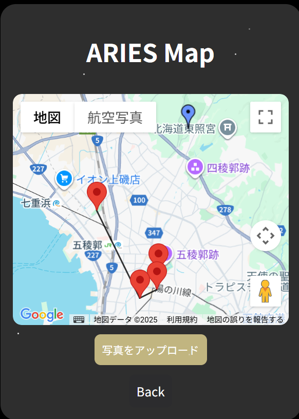
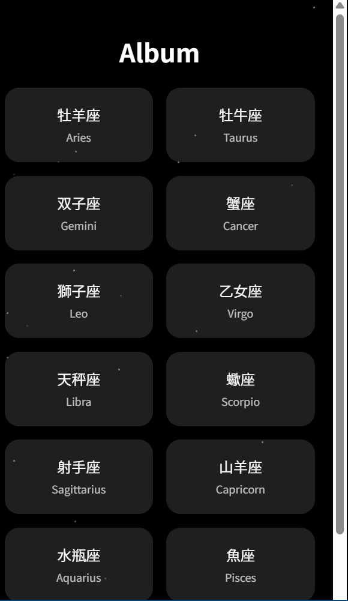
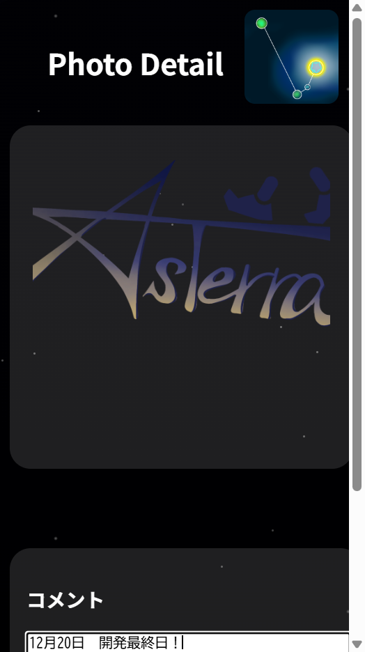

# P2HACKS2025 アピールシート

## プロダクト名
AsTerra(アステラ)のロゴ（左）とアイコン（右）  

## コンセプト
このアプリにおける「きらきら」は、星座の輝きといった直接的な光だけを指すものではありません。写真として残る思い出や、集めた場所を後から振り返った時に感じる、目には見えない輝きも表現しています。

## 対象ユーザ
日常生活に軽めの運動を取り入れたい人や、空き時間にすることを探している人向けのアプリです。目的地はアプリが決めてくれるので、「行き先が決まらない」、「決めるのがめんどくさい」という問題も起きません！

## 利用の流れ
アプリを開くと「新規登録」と「ログイン」のボタンが表示されます。初めての方は、まず新規登録をしてあなたのアカウントを作成します。今回はユーザー別にデータを保存することはできなかったので、写真を上げると全員に共有されてしまいます。ご注意ください。  
登録を終えると、「Journey」「Album」「Setting」と表示されるのでJourneyを選択してください。すると、牡羊座やふたご座といった星座名が並んでいると思います。今回はプレオープンとして牡羊座と蟹座の２つから選ぶことができます。  
どちらかの星座をタップすると、マップ上に複数の目的地が現れます。このとき、目的地を結ぶ線をよく見てください。実は目的地が選んだ星座の形を作っているのです。  
ユーザーはマップに表示された目的地を巡り、訪れた先で撮影した写真やコメントを記録として残すことができます。

## 推しポイント
星座×散歩という今までのアプリにはない組み合わせでアプリを作りました。星座をなぞっていると考えることで味わえる非日常感を楽しむことができます。目的地を目指す道中は、周りを観察しながら歩いてみてください。自分が知らなかったお店や景色など、意外な発見があるかもしれません。  
撮った写真とコメントはAlbumに保存され、単なる記録だけでなく「旅の追体験」を可能にしています。星座ごとにアルバムが分かれているため、すべて埋まった時の達成感はひとしおです。  
また、UIデザインにもこだわり、ダークモードでは背景に星がちりばめられるギミックを用意しました。是非Settingからダークモードに切り替えて、試してみてください。

## スクリーンショット(任意)

## 開発体制

### 役割分担
松田：リーダー・盛り上げ役・フロントエンド  
村上：フロントエンド・デザイン  
青木：バックエンド・提出資料の作成  
門脇：バックエンド・盛り上げ役  
梨本：バックエンド・スライドの作成・計画立案  

### 開発における工夫した点
- 最低限必要な機能は３日間でつくり、最後の２日間は最終確認と追加できそうな機能を実装した
- 開発する中で出てきた疑問や問題点はすぐに話し合い、認識のずれをなくしていった
- 初日に大まかな計画を決めた
- 具体的なタスクを書きだし、誰が何を担当するかを明確にした

## 開発技術

### 利用したプログラミング言語
- JavaScript
- HTML
- CSS

### 利用したフレームワーク・ライブラリ
- Express
- Google Maps JavaScript API

### その他開発に使用したツール・サービス
- GitHub
- Node.js
- ChatGPT
- Copilot
- 掌田津耶乃著，Node.js超入門[第4版]，秀和システム